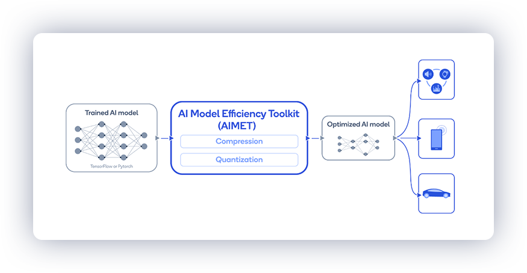

# AI Model Efficiency Toolkit (AIMET)

<a href="https://quic.github.io/aimet-pages/index.html">AIMET</a> is a library that provides advanced model quantization 
and compression techniques for trained neural network models.
It provides features that have been proven to improve run-time performance of deep learning neural network models with 
lower compute and memory requirements and minimal impact to task accuracy.  

AIMET is designed to work with [PyTorch](https://pytorch.org) and [TensorFlow](https://tensorflow.org) models.

## Table of Contents
- [Why AIMET?](#why-aimet)
- [Supported features](#supported-features)
- [Results](#results)
- [Getting started](#getting-started)
- [Contributions](#contributions)
- [Team](#team)
- [License](#license)

## Why AIMET?

* **Supports advanced quantization techniques**: Inference using integer runtimes is significantly faster than using floating-point runtimes. For example, models run
5x-15x faster on the Qualcomm Hexagon DSP than on the Qualcomm Kyro CPU. In addition, 8-bit precision models have a 4x 
smaller footprint than 32-bit precision models. However, maintaining model accuracy when quantizing ML models is often 
challenging.  AIMET solves this using novel techniques like Data-Free Quantization that provide state-of-the-art INT8 results on 
several popular models. 
* **Supports advanced model compression techniques** that enable models to run faster at inference-time and require less memory
* **AIMET is designed to automate optimization** of neural networks avoiding time-consuming and tedious manual tweaking.
AIMET also provides user-friendly APIs that allow users to make calls directly from their [TensorFlow](https://tensorflow.org) 
or [PyTorch](https://pytorch.org) pipelines.

Please visit the [AIMET on Github Pages](https://quic.github.io/aimet-pages/index.html) for more details.

## Supported Features

#### Quantization

* *Cross-Layer Equalization*: Equalize weight tensors to reduce amplitude variation across channels
* *Bias Correction*: Corrects shift in layer outputs introduced due to quantization
* *Quantization Simulation*: Simulate on-target quantized inference accuracy
* *Fine-tuning*: Use quantization simulation to train the model further to improve accuracy

#### Model Compression

* *Spatial SVD*: Tensor decomposition technique to split a large layer into two smaller ones
* *Channel Pruning*: Removes redundant input channels from a layer and reconstructs layer weights
* *Per-layer compression-ratio selection*: Automatically selects how much to compress each layer in the model

#### Visualization

* *Weight ranges*: Inspect visually if a model is a candidate for applying the Cross Layer Equalization technique. And the
effect after applying the technique
* *Per-layer compression sensitivity*: Visually get feedback about the sensitivity of any given layer in the model to
compression

## Results

AIMET can quantize an existing 32-bit floating-point model to an 8-bit fixed-point model without sacrificing much accuracy 
and without model fine-tuning. As an example of accuracy maintained, the DFQ method applied to several popular networks, 
such as MobileNet-v2 and ResNet-50, result in less than 0.9% loss in accuracy all the way down to 8-bit quantization — 
in an automated way without any training data.
<table style="width:50%">
  <tr>
    <th style="width:80px">Models</th>
    <th>FP32 </th>
    <th>INT8 Simulation </th>
  </tr>
  <tr>
    <td>MobileNet v2 (top1)</td>
    <td>71.72%</td>
    <td>71.08%</td>
  </tr>
  <tr>
    <td>ResNet 50 (top1)</td>
    <td>76.05%</td>
    <td>75.45%</td>
  </tr>
  <tr>
    <td>DeepLab v3 (mIOU)</td>
    <td>72.65%</td>
    <td>71.91%</td>
  </tr>
</table>

   

AIMET can also significantly compress models. For popular models, such as Resnet-50 and Resnet-18, compression with 
spatial SVD plus channel pruning achieves 50% MAC (multiply-accumulate) reduction while retaining accuracy within 
approx. 1% of the original uncompressed model.

<table style="width:50%">
  <tr>
    <th>Models</th>
    <th>Uncompressed model</th>
    <th>50% Compressed model</th>
  </tr>
  <tr>
    <td>ResNet18 (top1)</td>
    <td>69.76%</td>
    <td>68.56%</td>
  </tr>
  <tr>
    <td>ResNet 50 (top1)</td>
    <td>76.05%</td>
    <td>75.75%</td>
  </tr>
</table>

## Getting Started
* [Installation Guide](USAGE.md)
* [User Guide](https://quic.github.io/aimet-pages/AimetDocs/user_guide/index.html)
* [API Docs](https://quic.github.io/aimet-pages/AimetDocs/api_docs/index.html)
* [Discussion Forums](https://forums.quicinc.com/)
* [Tutorial Videos](https://quic.github.io/aimet-pages/index.html#video)

## Contributions
Thanks for your interest in contributing to AIMET! Please read our [Contributions Page](CONTRIBUTING.md) for more information on contributing features or bug fixes. We look forward to your participation!

## Team
AIMET aims to be a community-driven project maintained by Qualcomm Innovation Center, Inc.

## License
AIMET is licensed under the BSD 3-clause “New” or “Revised” License. Check out the [LICENSE](LICENSE) for more details.

